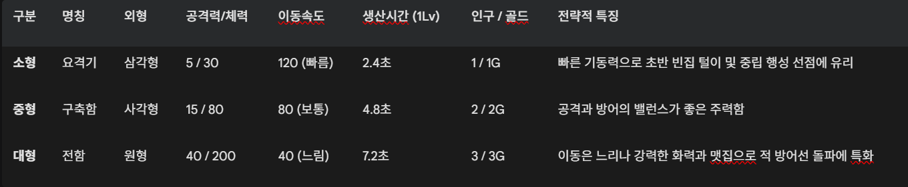

스페이스 배틀 플릿 (Space Battle Fleet) 최종 기획서

1. 게임 개요

게임명: 스페이스 배틀 플릿 (Space Battle Fleet)

장르: 2D 탑뷰 실시간 우주 영토 점령 전략 시뮬레이션 (RTS)

목표: 자신에게 주어진 시작 행성을 기반으로 자원과 병력을 모아, 맵 상의 모든 적(AI) 행성을 점령하고 우주를 통일하는 것.

핵심 재미 요소:

복잡한 빌드 오더 없이 직관적인 생산과 '어택땅' 위주의 대규모 물량전

행성 업그레이드와 3가지 병종을 활용한 전략적 가위바위보 상성

부대 지정, 다중 선택, 랠리 포인트 등 정통 RTS의 컨트롤 손맛

2. 핵심 자원 및 시스템

2.1. 인구수 (Population)

최대 인구수: 500 (플레이어 및 AI 동일하게 적용)

시스템: 병력을 생산할 때마다 각 유닛에 배정된 인구수(1~3)를 차지하며, 유닛이 파괴되면 인구수가 반환됩니다. 인구수가 최대치에 도달하면 행성에서의 생산이 일시 중지됩니다.

2.2. 자금 (Gold)

획득처: 적(AI)의 유닛을 파괴할 때마다 유닛 체급에 따라 골드를 획득합니다. (소형 1G / 중형 2G / 대형 3G)

사용처: 아군 소유 행성의 레벨 업그레이드에 사용됩니다.

2.3. 승패 조건 (Phase System)

승리 (VICTORY): 적(AI) 소유의 행성이 맵 상에 0개가 되면 즉시 승리합니다.

패배 (DEFEAT): 플레이어 소유의 행성이 맵 상에 0개가 되면 즉시 패배합니다.

3. 행성 (Planet) 및 영토 시스템

3.1. 행성 상태 및 소유권

아군 행성 (파란색): 플레이어의 유닛이 생산되는 기지입니다.

적군 행성 (붉은색): AI의 유닛이 생산되는 기지입니다.

중립 행성 (회색): 기본 내구도(200 HP)를 가지며, 점령 전까지는 유닛을 생산하지 않습니다.

점령 시스템: 함선이 목표 행성의 HP를 0으로 깎으면 즉시 마지막 공격을 가한 진영의 소유로 넘어갑니다. 점령 시 HP가 최대치로 회복되며, 레벨이 1로 초기화되고 기본 유닛(요격기)을 생산하기 시작합니다.

3.2. 행성 레벨 및 업그레이드

기본 상태: 모든 행성은 점령 시 1레벨로 시작합니다.

업그레이드 비용: 현재 레벨 × 50G (예: 1레벨 -> 2레벨은 50G, 2레벨 -> 3레벨은 100G)

레벨업 효과: 행성 레벨이 1 오를 때마다 해당 행성의 유닛 생산 시간이 10%씩 단축됩니다. (단축 최대치는 90%로 제한되어 0초 생산 방지)

3.3. 랠리 포인트 (집결지)

아군 행성을 선택하고 빈 우주 공간이나 타겟 행성을 우클릭하면 랠리 포인트가 지정됩니다.

작동 방식:

지정 시 해당 행성에 대기 중이던 모든 유닛이 즉시 목표로 출격합니다.

이후 해당 행성에서 새로 스폰되는 유닛들도 멈추지 않고 즉시 목표 지점으로 날아갑니다.

4. 유닛 (Unit) 기획

유닛은 크게 3종류로 나뉘며, 각기 다른 외형(도형), 능력치, 생산 속도, 요구 인구수를 가집니다.

4.1. 부대 AI 및 진형 유지 알고리즘

자동 교전: 사거리 내에 적 유닛이나 적대 행성이 포착되면 이동을 멈추고 0.5초의 쿨타임마다 레이저 공격(파티클 이펙트)을 가합니다. 적 유닛을 우선적으로 타겟팅합니다.

겹침 방지 (Separation): 수백 기의 유닛이 한 점으로 뭉치는 것을 방지하기 위해 유닛 간 거리를 계산하여 서로 밀어내는 알고리즘이 적용되어 있습니다. 목표에 도달하면 자연스럽게 원형 진형을 갖춥니다.

5. 조작 및 UI 시스템

5.1. 마우스 및 키보드 컨트롤

좌클릭 (단일/드래그): 행성을 단일 선택하거나, 화면을 드래그하여 다수의 아군 유닛을 직접 지휘할 수 있습니다. (유닛이 드래그되면 행성 선택은 취소됩니다.)

더블클릭: 화면 내에 보이는 모든 아군 행성을 한 번에 동시 선택합니다.

우클릭 (명령):

적/중립 행성 우클릭: 점령 및 공격 명령

빈 공간 우클릭: 강제 이동 명령 (유닛) / 랠리 포인트 좌표 지정 (행성)

WASD 또는 방향키: 전장 카메라 이동

부대 지정 (Shift + 1~4): 현재 선택된 유닛들을 특정 숫자 슬롯에 기억시킵니다. (스타크래프트 방식)

부대 호출 (1~4): 기억된 번호를 눌러 화면 어디서든 즉시 해당 유닛 부대를 선택합니다.

5.2. 미니맵 (Minimap) 시스템

우측 하단에 300x300 사이즈의 전체 맵을 조망할 수 있는 미니맵이 제공됩니다.

좌클릭 및 드래그: 카메라(화면)가 클릭/드래그한 위치로 즉시 이동합니다.

우클릭: 화면을 이동하지 않고도 미니맵 상의 특정 좌표로 병력을 보내거나 랠리 포인트를 찍을 수 있습니다.

5.3. 하단 컨트롤 패널 (UI)

행성을 선택하면 화면 하단에 패널이 등장합니다.

현재 선택된 행성 개수와 체력이 표시되며, 생산할 유닛(요격기/구축함/전함)을 클릭하여 변경할 수 있습니다.

자금이 충분할 경우 [레벨 업그레이드] 버튼이 활성화되어 행성의 생산 효율을 높일 수 있습니다.

6. 인공지능 (AI) 시스템

행동 주기 (Pulse): AI는 5초에 한 번씩 전장 상황을 판단하고 명령을 내립니다.

생산 무작위화: 행동 주기마다 30%의 확률로 AI 행성의 생산 유닛이 변경됩니다. (요격기 50%, 구축함 30%, 전함 20% 확률 부여) 이를 통해 AI도 가위바위보 조합을 섞어서 공격해 옵니다.

공격 판정: 특정 AI 행성에 대기 중인 잉여 유닛이 5기를 초과하면, 즉시 해당 유닛들을 맵 상의 무작위 적대 행성(플레이어 또는 중립)으로 파견하여 끊임없이 플레이어를 압박합니다.

//////////////////////////////////////

스페이스 배틀 플릿 - AI 바이브 코딩 프롬프트 명세서

이 문서는 LLM(GitHub Copilot, Claude, GPT 등)을 활용하여 React + HTML5 Canvas 기반의 RTS 게임을 단일 컴포넌트(Single File Component)로 구현하기 위한 시스템 및 아키텍처 지시서입니다.

1. 기술 스택 및 코딩 제약 사항 (System Prompts)

AI에게 코드를 요청할 때 반드시 지켜야 할 기본 규칙입니다.

프레임워크: React (Functional Component) + HTML5 <canvas>

스타일링: Tailwind CSS (UI 레이어 및 오버레이용)

에셋 처리: 외부 이미지나 에셋을 사용하지 말고, 모든 행성, 유닛, 이펙트(파티클)는 Canvas 2D API (도형, 선, 색상, 그림자 등)로 직접 렌더링할 것.

파일 구조: 모든 게임 로직, 상태 관리, UI는 App.jsx 하나의 파일에 작성할 것.

타임스텝: 프레임워크 종속적인 속도를 피하기 위해 requestAnimationFrame과 deltaTime(dt) 기반의 물리/이동 연산을 반드시 적용할 것.

2. 상태 관리 아키텍처 (Core Architecture)

React 생명주기 문제와 Canvas 렌더링 최적화를 위해 상태를 엄격히 분리하여 구현해야 합니다.

2.1. 게임 코어 상태 (useRef 사용 - 렌더링 독립)

초당 60프레임 이상 업데이트되는 모든 물리 연산과 게임 데이터는 useState가 아닌 **useRef**에 담아 React의 리렌더링을 방지합니다.

planets: 행성 배열 (위치, 소유권, 체력, 레벨 등)

units: 유닛 배열 (위치, 속도, 타겟, 상태)

particles: 이펙트 객체 배열

camera: { x, y, w, h } (현재 화면 좌표)

mouse, keys: 입력 상태 및 드래그 좌표 추적

controlGroups: 부대 지정 정보 ({'1': Set, '2': Set...})

2.2. UI 상태 (useState 사용 - 초당 10회 제한 동기화)

사용자에게 보여야 하는 UI 패널(자원, 선택된 행성 정보 등)만 useState로 관리하며, update 루프 내에서 타이머(예: 0.1초)를 두어 주기적으로만 syncUiState()를 호출해 성능을 확보합니다.

playerGold, playerPop

selectedPlanets, selectedUnitsCount, controlGroupsCount

phase: 'start' | 'playing' | 'gameover'

3. 핵심 엔티티 및 자료 구조 (Data Structures)

3.1. Faction (진영)

0: NEUTRAL (회색), 1: PLAYER (파란색), 2: AI (빨간색)

3.2. Planet (행성) 객체 명세

{
  id: string,
  x: number, y: number, radius: number,
  owner: 0 | 1 | 2,
  hp: number, maxHp: number,
  level: number, // 1부터 시작, 레벨당 생산속도 10% 감소
  productionType: 1 | 2 | 3, // 생산 중인 유닛 타입
  spawnTimer: number, // dt 누적
  rallyPoint: { x, y } | null, // 집결지 좌표
  rallyPointPlanetId: string | null // 목표 행성 ID
}

3.3. Unit (유닛) 상수 및 객체 명세

유닛 타입(1: 요격기/삼각형, 2: 구축함/사각형, 3: 전함/원형).
속도는 px/sec 단위.

1티어: hp: 30, atk: 5, speed: 120, spawnTime: 2.4s, 반경: 6, 인구: 1, 골드: 1

2티어: hp: 80, atk: 15, speed: 80, spawnTime: 4.8s, 반경: 9, 인구: 2, 골드: 2

3티어: hp: 200, atk: 40, speed: 40, spawnTime: 7.2s, 반경: 14, 인구: 3, 골드: 3

{
  id: string, owner: 1 | 2, type: 1 | 2 | 3,
  x: number, y: number, vx: number, vy: number,
  state: 'IDLE' | 'MOVING' | 'IDLE_FIELD',
  homePlanetId: string | null, // 랠리가 찍히면 즉시 null 처리
  targetPlanetId: string | null, 
  targetX: number | null, targetY: number | null,
  attackCooldown: number // 0.5초(sec) 마다 공격
}

4. 핵심 알고리즘 및 구현 지시사항 (Implementation Details)

AI가 코드를 짤 때 가장 많이 실수하는 부분들입니다. 이 규칙들을 반드시 프롬프트에 포함하세요.

4.1. 유닛 겹침 방지 (Separation / Flocking) 로직

모든 유닛의 이동 업데이트(x += vx * dt) 직전에, 서로 밀어내는 힘(Separation)을 벡터(sepX, sepY)로 계산하여 vx, vy에 더해야 합니다.

연산 부하를 줄이기 위해 Math.abs(dx) > 35 인 경우 거리 계산(Math.hypot)을 생략하는 최적화를 반드시 적용할 것.

4.2. 랠리 포인트(체인 이동)와 즉시 출격 로직

행성을 선택하고 우클릭하여 랠리 포인트를 지정(p.rallyPoint)하는 순간, 해당 행성을 homePlanetId로 가지며 IDLE 상태인 유닛들은 즉시 state를 MOVING으로 바꾸고 목표를 향해 출발해야 합니다.

유닛이 목표 아군 행성에 도착했을 때, 그 행성에도 rallyPoint가 존재한다면 멈추지 않고 즉시 그 랠리 포인트를 target으로 삼아 이동(체인 랠리)해야 합니다.

4.3. 미니맵 상호작용 (Minimap Interactions)

미니맵 영역(x >= mmX && y >= mmY...)을 클릭했을 때의 이벤트를 분리 구현할 것.

좌클릭 및 드래그: camera.x, camera.y를 즉시 업데이트하여 화면 이동 (isMinimapDragging 상태 활용).

우클릭: 화면을 이동시키지 말고 클릭한 픽셀을 World 좌표로 변환하여 병력 이동 및 랠리 포인트 지정.

4.4. 조작 편의성 (RTS Controls)

더블클릭 판정: 마우스 다운 이벤트 시 Date.now()를 활용해 300ms 내에 동일 행성을 클릭하면, 현재 화면(camera.x, y, w, h) 범위 내의 모든 아군(owner === 1) 행성을 selectedPlanetIds에 추가할 것.

부대 지정 (Control Groups): keydown 이벤트에서 Shift + 1~4 감지 시 선택된 유닛 Set을 저장하고, 숫자 키 단독 입력 시 해당 Set을 다시 불러와 선택 상태로 만들 것. 사망한 유닛(hp <= 0)은 호출 시 필터링할 것.

4.5. AI 진영 로직 (Pulse System)

update 루프 안에서 매 프레임 AI를 연산하지 말고, 타이머 변수를 두어 **5초(dt >= 5)마다 한 번씩 행동(Pulse)**하도록 할 것.

30% 확률로 각 AI 행성의 생산 유닛 productionType을 무작위로 변경.

각 행성에 대기 중인 유닛이 5기를 초과하면, 그 유닛들을 맵 상의 무작위 적대(플레이어 또는 중립) 행성으로 타겟팅하여 파견함.

5. 초기화 및 게임 페이즈 (Game Flow)

App 마운트 시 phase: 'start'로 시작하며 타이틀과 [게임 시작] 버튼을 렌더링함.

시작 시 initGame() 함수가 호출되며, 3000 x 2000 맵에 플레이어 행성 2개(좌), AI 행성 2개(우), 무작위 중립 행성 15개를 생성. (중립 행성은 유닛 간 충돌 방지를 위해 거리가 최소 150 이상 떨어지도록 while문으로 유기적 배치)

플레이어나 AI의 행성 갯수가 0이 되면 phase: 'gameover'로 전환하고 VICTORY/DEFEAT 오버레이 출력.